<!-- README.md is generated from README.Rmd. Please edit that file -->

# bmd

This is an R package for benchmark dose (BMD) estimation, which expands
upon the functionality of the drc package.

This package is currently maintained by Jens Riis Baalkilde and Signe
Marie Jensen, Department of Plant and Environmental Sciences, University
of Copenhagen.

## Installation

Install the bmd package from GitHub. The bmd package works best with the
drc package installed from GitHub as well.

``` r
install.packages("devtools")
devtools::install_github("DoseResponse/drcData")
devtools::install_github("DoseResponse/drc")
devtools::install_github("DoseResponse/bmd")
```

## Key features

The bmd package is a natural extension of the drc package. Key features
of the bmd package includes:

- Benchmark dose (BMD) estimation for quantal, continuous, count and
  ordinal data for a wide range of definitions of BMD.
  - A range of confidence intervals for BMD estimates, including Wald,
    Profile and Bootstrap intervals.
  - BMD estimation based on model averaging.
  - BMD estimation for multiple dose-response curves.
- Utility functions for plotting dose-response curves and BMD estimates.

## Example usage

In the following it is demonstrated how to use the functions in the bmd
package on two data sets with a continuous response variable and one
data set with a quantal response.

### Example 1 (secalonic)

First, the data set from the drcData package is loaded, and a
dose-response model is fitted.

``` r
data("secalonic")
secalonic.LL.4 <- drm(rootl ~ dose, data = secalonic, fct = LL.4())
```

Users familiar with the drc package already know how straight-forward it
is to plot dose-response models using the plot() function. The
qplotDrc() function in the bmd package mimics the same functionality
based on ggplot2.

``` r
plot(secalonic.LL.4, main = "Secalonic model plotted by basic R plotting")
```

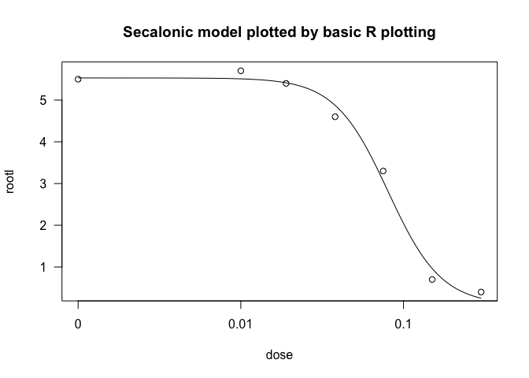<!-- -->

``` r
qplotDrc(secalonic.LL.4) + ggplot2::labs(title = "Secalonic model plotted by ggplot2")
```

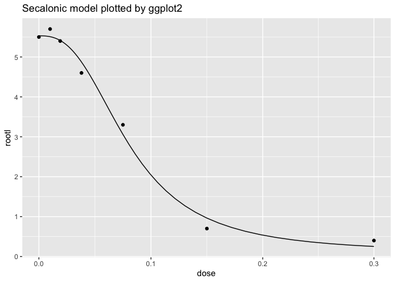<!-- -->

Similar to the old method of plotting dose-response curves, qplotDrc()
features several options for customisation.

``` r
qplotDrc(secalonic.LL.4, type = "all")
```

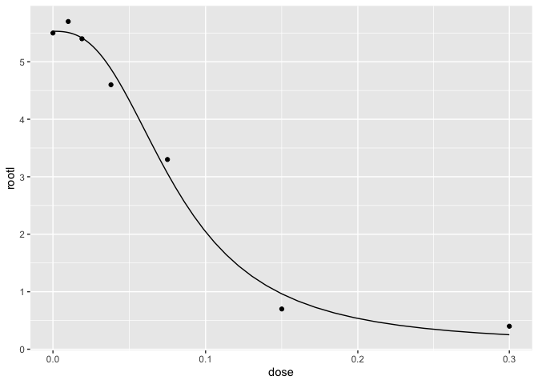<!-- -->

``` r
qplotDrc(secalonic.LL.4, type = "obs")
```

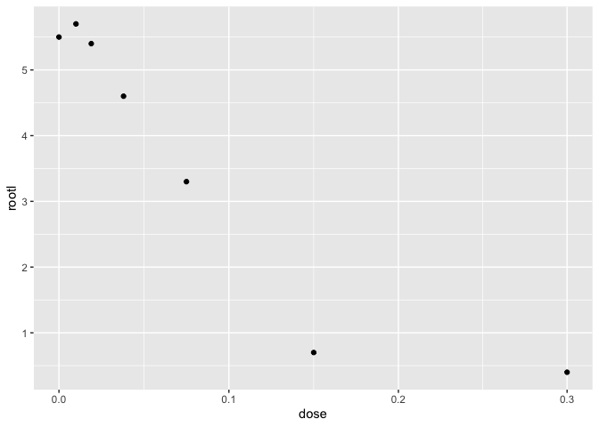<!-- -->

``` r
qplotDrc(secalonic.LL.4, type = "bars")
```

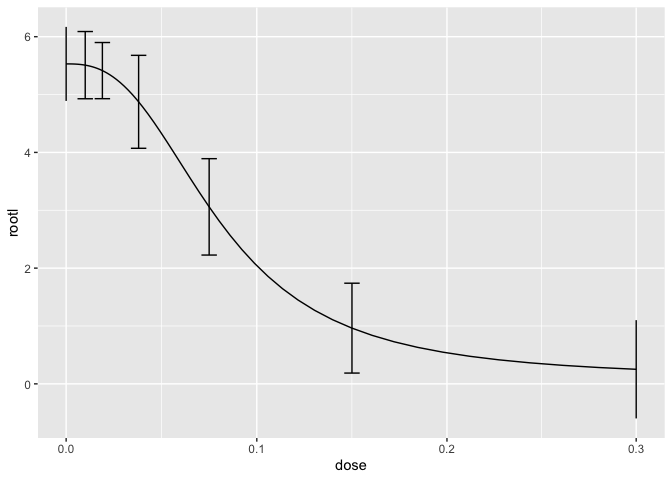<!-- -->

``` r
qplotDrc(secalonic.LL.4, type = "confidence")
```

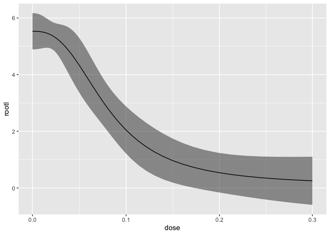<!-- -->

#### Example 1: BMD estimation

A wide range of BMD definitions are implemented in the bmd package. In
the following, the BMD and BMDL based on the “relative risk” definition
recommended by EFSA, with a BMR = 10% are computed.

``` r
bmd(secalonic.LL.4, bmr = 0.1, backgType = "modelBased", def = "relative")
```

    ##       BMD       BMDL
    ##  0.035362 0.01579886

The default interval is a Wald type confidence interval. If a profile
likelihood confidence interval is preferred, this can be specified by
the “interval” argument.

``` r
bmd(secalonic.LL.4, bmr = 0.1, backgType = "modelBased", def = "relative", interval = "profile")
```

    ##       BMD       BMDL
    ##  0.035362 0.02619532

The current state-of-the-art definition of the BMD is the hybrid
definition. In the following, the BMD and BMDL based on the “excess
risk” definition based on the hybrid method with BMR = 10%, and adverse
background level set to the estimated background level minus 1SD is
calculated.

``` r
bmd(secalonic.LL.4, bmr = 0.1, backgType = "hybridSD", backg = 1, def = "hybridExc")
```

    ##         BMD         BMDL
    ##  0.01720857 2.344327e-05

For technical reasons, profile intervals for BMD estimates based on the
hybrid method, are not currently available.

#### Example 1: BMD plotting

The qplotBmd() function ca be used to plot BMD along with the
dose-response curve.

``` r
qplotBmd(bmd(secalonic.LL.4, bmr = 0.1, backgType = "modelBased", def = "relative", display = FALSE)) # display = FALSE hides output from bmd function
```

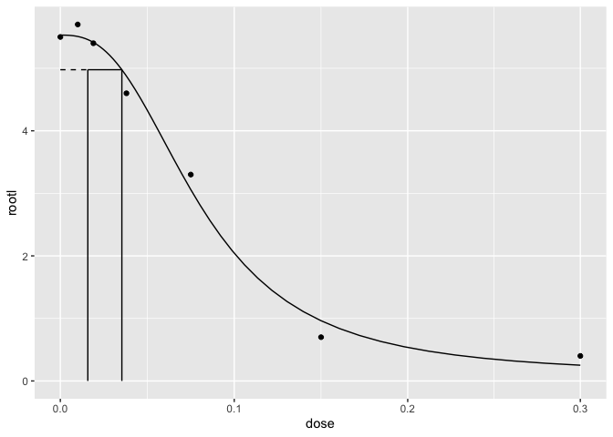<!-- -->

#### Example 1: BMD estimation using MA

An additional set of dose-response models are fitted.

``` r
secalonic.LL.3 <- drm(rootl ~ dose, data = secalonic, fct = LL.3())
secalonic.LN.3 <- drm(rootl ~ dose, data = secalonic, fct = LN.3())
secalonic.LN.4 <- drm(rootl ~ dose, data = secalonic, fct = LN.4())
secalonic.W1.3 <- drm(rootl ~ dose, data = secalonic, fct = W1.3())
secalonic.W1.4 <- drm(rootl ~ dose, data = secalonic, fct = W1.4())
secalonic.W2.3 <- drm(rootl ~ dose, data = secalonic, fct = W2.3())
secalonic.W2.4 <- drm(rootl ~ dose, data = secalonic, fct = W2.4())

secalonic.modelList <- list(secalonic.LL.3, secalonic.LL.4, secalonic.LN.3, secalonic.LN.4,
                            secalonic.W1.3, secalonic.W1.4, secalonic.W2.3, secalonic.W2.4)
```

BMD can now be estimated by MA by using the function bmdMA. Type of
model weights need to be specified as well as MA type.

``` r
bmdMA(secalonic.modelList, modelWeights = "AIC", type = "Buckland", bmr = 0.1, backgType = "modelBased", def = "relative")
```

    ##     BMD_MA    BMDL_MA
    ##  0.0317763 0.02391615

``` r
set.seed(123)
bmdMA(secalonic.modelList, modelWeights = "AIC", type = "bootstrap", bmr = 0.1, backgType = "modelBased", def = "relative", R = 500, progressInfo = FALSE)
```

    ##     BMD_MA    BMDL_MA
    ##  0.0317763 0.02821126

``` r
bmdMA(secalonic.modelList, modelWeights = "AIC", type = "Buckland", bmr = 0.1, backgType = "hybridSD", def = "hybridExc", backg = 1)
```

    ##      BMD_MA     BMDL_MA
    ##  0.01007999 0.004875864

### Example 2 (S.alba.comp, two dose-response curves)

An experiment was conducted where some pots were treated with the
herbicide Bentazone, and other pots were treated with Glyphosate. A
model with separate curves for each herbicide is fitted as follows.

``` r
data("S.alba.comp")
S.alba.comp.LL.4 <- drm(drymatter ~ dose, curveid = herbicide, data = S.alba.comp, fct = LL.4())
```

To plot the function, qplotDrc can be used:

``` r
qplotDrc(S.alba.comp.LL.4)
```

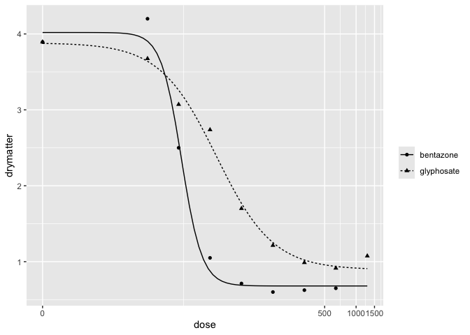<!-- -->

``` r
qplotDrc(S.alba.comp.LL.4, col = TRUE, type = "confidence") +
  qplotDrc(S.alba.comp.LL.4, col = TRUE, type = "obs", add = TRUE)$obsLayer
```

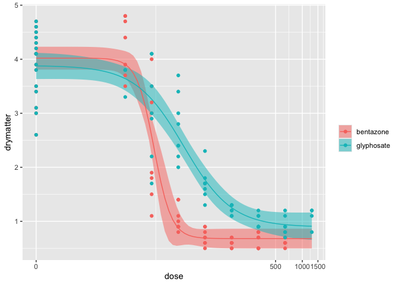<!-- -->

This also illustrates how qplotDrc() can be layered to produce custom
plots, by using the argument “add = TRUE”, and choosing either the layer
of observations (“obsLayer”), the layer with the dose-response curve
(“curveLayer”), or the layer with the confidence band around the curves
(“confBandLayer”).

#### Example 2: BMD estimation.

BMD and BMDL can be estimated for the individual curves:

``` r
bmd(S.alba.comp.LL.4, bmr = 0.1, backgType = "modelBased", def = "relative")
```

    ##                 BMD      BMDL
    ## bentazone  13.57966 10.862398
    ## glyphosate 14.16426  7.480309

``` r
bmd(S.alba.comp.LL.4, bmr = 0.1, backgType = "hybridSD", backg = 1, def = "hybridExc")
```

    ##                  BMD     BMDL
    ## bentazone  10.664119 7.252415
    ## glyphosate  7.425644 2.321537

### Example 3 (acute.inh, binomial response)

20 animals were exposed to 4 doses of an unknown substance, 5 animals
per dose. The number of dead animals for each dose were recorded. In the
following, the data is loaded, and a 2-parameter is fitted to the data.
Subsequently, a plot of the resulting dose-response curve is created
using qplotDrc().

``` r
data("acute.inh")
acute.inh.LL.2 <- drm(num.dead/total ~ dose, weights = total, data = acute.inh, fct = LL.2(), type = "binomial")

qplotDrc(acute.inh.LL.2)
```

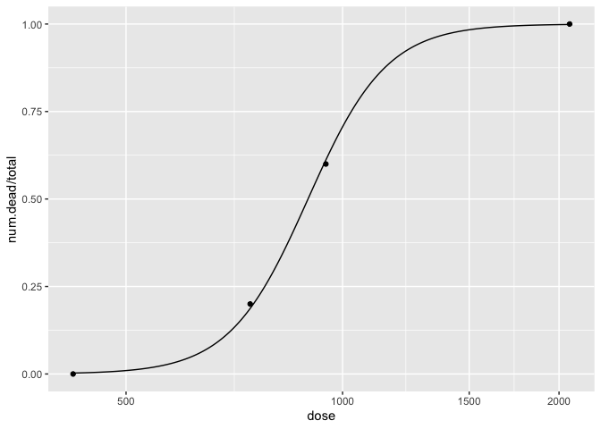<!-- -->

#### Example 3: BMD Estimation

For binomial response data, the “excess” and “additional” BMD
definitions are available. When the background response is $0$, they are
identical:

``` r
bmd(acute.inh.LL.2, bmr = 0.1, backgType = "modelBased", def = "additional")
```

    ##       BMD     BMDL
    ##  678.6335 481.0896

``` r
bmd(acute.inh.LL.2, bmr = 0.1, backgType = "modelBased", def = "excess")
```

    ##       BMD     BMDL
    ##  678.6335 481.0896

``` r
qplotBmd(bmd(acute.inh.LL.2, bmr = 0.1, backgType = "modelBased", def = "additional", display = FALSE)) +
  ggplot2::scale_x_continuous(limits = c(0,2100), trans = scales::transform_pseudo_log(2000))
```

    ## Scale for x is already present.
    ## Adding another scale for x, which will replace the existing scale.

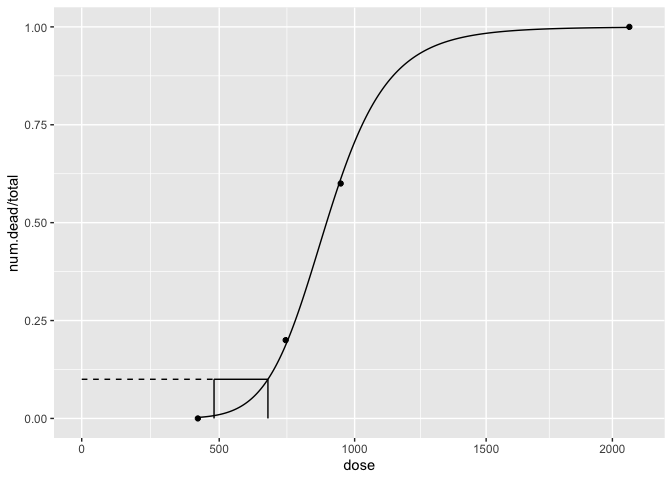<!-- -->
